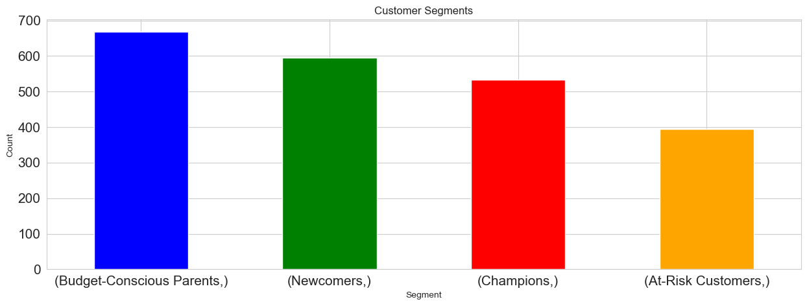
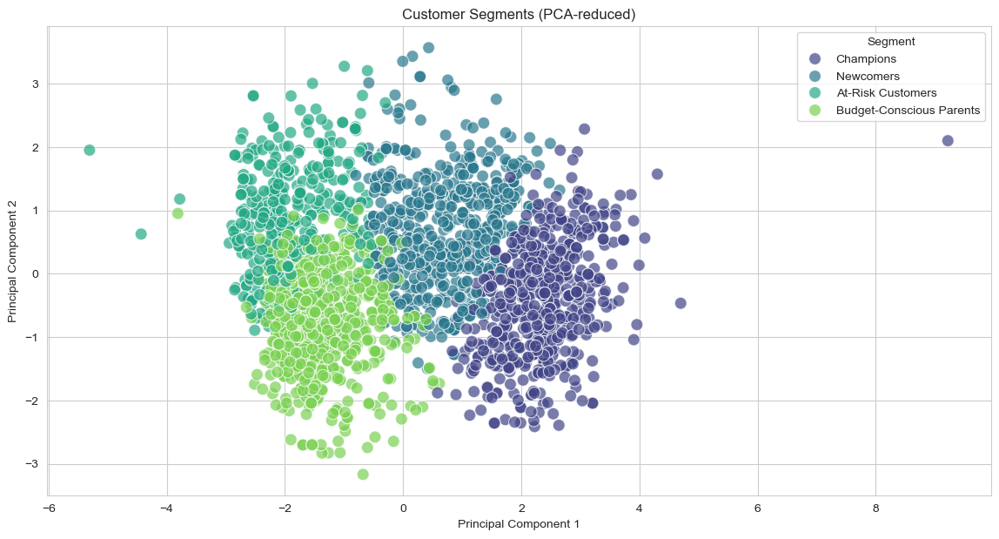

# <p align = 'center'>Marketing Analytics & Customer Insights </p>

### PROBLEM STATEMENT

The effectiveness of our recent marketing campaigns has been underwhelming, because a one-size-fits-all approach fails to resonate with our diverse customer base. This leads to wasted marketing spend and missed opportunities for customer retention and growth.

This project aims to address these challenges by performing a deep-dive analysis of customer data to:
- **Group customers together:** Instead of treating everyone the same, we'll find distinct customer groups so we can create unique marketing messages that actually work for each group.
- **Predict customer behavior:** We'll build models that can predict which customers are most likely to buy from a campaign or who might leave us soon. This lets us focus our efforts where they'll have the biggest impact.
- **Identify our most valuable customers:** We'll predict which customers will be most valuable to us over time. This helps us focus on keeping them happy and loyal.
- **Find common buying habits:** We'll look for patterns in what customers buy. This will show us great opportunities for suggesting new products to them.

The ultimate goal is to propose a set of data-driven solutions that will make marketing efforts more targeted, efficient, and profitable.

---

### BRIEF
1. Applied `Data Preparation` and `Feature Engineering` to process the raw data and make it ready for analysis.
2. Performed **Customer Segmentation** is to divide the customer base into distinct groups (`Champions`, `At-Risk Customers`,  `Budget-Conscious Parents`, `Newcomers`)  enabling more effective and targeted business strategies.
3. Visualzed the data and perform trend analysis to identify sequential **Demand patterns** and **Seasonality customer behavior**.
4. **Campaign Response Prediction:** Predicted which customers are most likely to accept a future campaign offer
5. Designed Interactive dashboards using **Flourish** to analyze the trends, give recommendations and publish the findings.
6. Implemented a **Feature Store** using `Feast` to centralize, standardize, and reuse curated customer features across multiple campaigns, enabling consistent and efficient deployment of ML models.

---

### DATA DESCRIPTION

The dataset for this project is provided by Dr. Omar Romero-Hernandez. It is licensed as CC0: Public Domain. The dataset is collected from kaggle - https://www.kaggle.com/datasets/jackdaoud/marketing-data?taskId=2986

| No. | Field                | Description                                                                 |
|-----|----------------------|-----------------------------------------------------------------------------|
| 1   | ID                   | Customer’s unique identifier                                                |
| 2   | Year_Birth           | Customer’s birth year                                                       |
| 3   | Education            | Customer’s education level                                                  |
| 4   | Marital_Status       | Customer’s marital status                                                   |
| 5   | Income               | Customer’s yearly household income                                          |
| 6   | Kidhome              | Number of children in customer’s household                                 |
| 7   | Tennhome             | Number of teenagers in customer’s household                                |
| 8   | Dt_Customer          | Date of customer’s enrollment with the company                             |
| 9   | Recency              | Number of days since customer’s last purchase                              |
| 10  | MntWines             | Amount spent on wine in the last 2 years                                   |
| 11  | MntFruits            | Amount spent on fruits in the last 2 years                                 |
| 12  | MntMeatProducts      | Amount spent on meat in the last 2 years                                   |
| 13  | MntFishProducts      | Amount spent on fish in the last 2 years                                   |
| 14  | MntSweetProducts     | Amount spent on sweets in the last 2 years                                 |
| 15  | MntGoldProds         | Amount spent on gold in the last 2 years                                   |
| 16  | NumDealsPurchase     | Number of purchases made with a discount                                   |
| 17  | NumWebPurchase       | Number of purchases made through the company’s website                     |
| 18  | NumCatalogPurchase   | Number of purchases made using a catalog                                   |
| 19  | NumStorePurchase     | Number of purchases made directly in stores                                |
| 20  | NumWebVisitsMonth    | Number of visits to company’s website in the last month                    |
| 21  | AcceptedCmp3         | 1 if customer accepted the offer in the 3rd campaign, 0 otherwise          |
| 22  | AcceptedCmp4         | 1 if customer accepted the offer in the 4th campaign, 0 otherwise          |
| 23  | AcceptedCmp5         | 1 if customer accepted the offer in the 5th campaign, 0 otherwise          |
| 24  | AcceptedCmp1         | 1 if customer accepted the offer in the 1st campaign, 0 otherwise          |
| 25  | AcceptedCmp2         | 2 if customer accepted the offer in the 1st campaign, 0 otherwise          |
| 26  | Response             | 1 if customer accepted the offer in the last campaign, 0 otherwise         |
| 27  | Complain             | 1 if a customer complained in the last 2 years, 0 otherwise                |
| 28  | Country              | Customer’s location                                                        |

---

### FEATURE ENGINEERING

##### 1. Customer Demographics Features

1. What is the Age of our consumers?
```
Age = Current_Year - Year_Birth
```

2. If there is is either a kid or teen at home then they have parents:
```
Is_Parent = 1 if (Kidhome + Teenhome) > 0 else 0
```

3. Total kids in a household
``` 
Total_Kids = Kidhome + Teenhome
```

4. Marital_Status_Simplified: Group marital status into broader categories:

```
- "Married" or "Together" → **Partnered**  
- All others (e.g., "Single", "Divorced", "Widow", etc.) → **Single**
```

##### 2. Purchase Behavior Features

1. Total Amount spent on all the products:
```
Total_Spent = MntWines + MntFruits + MntMeatProducts + MntFishProducts + MntSweetProducts + MntGoldProds
```

2. How much a consumer is Spending per Category:
```
Share of spending per category (example for Wine and Meat):  
- Wine_Share = MntWines / Total_Spent  
- Meat_Share = MntMeatProducts / Total_Spent  
*(Apply similarly for other product categories)*
```

3. On an average, how much a consumer is spending per Purchase: 
```
Average_Spend_per_Purchase = Number of times the customer purchased (Num of Deals Purchases + Num of Web Purchases + Num Catalog Purchases + Num Store Purchases) per total amount spent
```

4. Are the customers depended on deals? 
```
Deal_Rate = NumDealsPurchases / Total_Purchases
```

##### 3. Channel Engagement Features

1. What is the Total Purchases made by the consumer?
```        
Total_Purchases: Num of Web Purchases + Num of Catalog Purchases + Num of Store Purchases
```

2. Web_Engagement:
```
- Web_Purchase_Share = NumWebPurchases / Total_Purchases  
- Web_Visit_to_Purchase_Ratio = NumWebVisitsMonth / (NumWebPurchases + 1)
```

3. Does the consumer buys the products from online channels?
```
Is_Online_Buyer: if Num of Web Purchases more than Num Store Purchases
```

##### 4. Temporal Features

1. Since when the customer is with us? 
```
Customer_Since_Days = Today - Date of Customer
```

2. Did the customer made any Purchase in less than 30 days? (Recent_Activity)
```
Is_Active = 1 if Recency < 30 else 0
```

3. How much did the consumer spent since he was a customer with us?
```
Customer_Lifetime_Spend_per_Day = Total_Spent / Customer_Since_Days
```

##### 5. Campaign Response Features

1. What is the sum of all campaign responses?
```
    Total_Accepted_Campaigns = AcceptedCmp1 + AcceptedCmp2 + AcceptedCmp3 + AcceptedCmp4 + AcceptedCmp5
```

2. What is the Response rate for the campaign?
```
Campaign_Response_Rate: Total accepted Campaigns per total number of campaigns
```

3. Does the consumer responded to any of our campaigns?
```
Is_Responder = 1 if Total_Accepted_Campaigns > 0 or Response == 1 else 0
```

---

### PROJECTS
#### 1. CUSTOMER SEGMENTATION ANALYSIS (Unsupervised Learning)

##### PROBLEM STATEMENT
Traditional marketing strategies treat all customers the same, which leads to suboptimal results. The goal of customer segmentation is to divide the customer base into distinct groups with similar characteristics, enabling more effective and targeted business strategies.

##### WHY CUSTOMER SEGMENTATION?
- **Personalization:** Tailor marketing, product recommendations, and communications to each segment for higher engagement and ROI.
- **Retention:** Identify at-risk customers and proactively address their needs.
- **Resource Optimization:** Allocate marketing resources more efficiently by focusing on high-value or at-risk segments.

##### METHODOLOGY
**1. Feature Selection & Preprocessing:**
     - Selected features such as `Age`, `Income`, `Total_Kids`, `Recency`, `Total_Spent`, `Total_Purchases`, `Deal_Rate`, and `Customer_Since_Days`.
     - Imputed missing values and scaled features for clustering.
**2. Clustering:**
     - Used K-Means clustering (with optimal k=4) to group customers based on the selected features.
**3. Segment Mapping:**
     - Analyzed cluster profiles and mapped them to business personas:

| Segment                  | Profile Description                                      | Targeted Actions |
|--------------------------|---------------------------------------------------------|------------------|
| Champions                | High income, high spenders, recent buyers               | Reward & Retain: VIP programs, exclusive offers |
| At-Risk Customers        | Previously active, now infrequent buyers (high recency) | Win Back: Personalized discounts, feedback surveys |
| Budget-Conscious Parents | Multiple kids, moderate income, deal-seekers            | Promote bundles, highlight discounts, family offers |
| Newcomers                | New to company, few purchases                           | Welcome campaigns, onboarding, small incentives |

**4. VISUALIZATION**
Visualized segments using bar plots and PCA-reduced scatter plots for interpretability and better decision making:

**4.1 Customer Segments Bar Plot**


**4.2 Customer Segments (PCA-reduced)**


##### RECOMMENDATIONS & TARGETED INTERVENTIONS
- **Champions:**
    - Grant early access to new products and invite to VIP loyalty programs.
    - Send exclusive, non-discount offers to reinforce loyalty.
- **At-Risk Customers:**
    - Launch "We Miss You" campaigns with personalized incentives.
    - Solicit feedback to understand reasons for inactivity.
- **Budget-Conscious Parents:**
    - Promote family-sized bundles and value packs.
    - Notify about sales and discount opportunities.
- **Newcomers:**
    - Send a welcome email series and offer a small discount on the second purchase.
    - Guide them to create an account or sign up for the newsletter.

This segmentation enables the business to deliver the right message to the right customer at the right time, maximizing marketing effectiveness and customer satisfaction.

---

#### 2. Predictive Modeling (Supervised Classification)
*   **Goal:** Build models to predict specific customer actions, optimizing marketing spend and retention efforts.
*   **Projects:**
    *   **Campaign Response Prediction:** Predict which customers are most likely to accept a future campaign offer. Use `Response` or `Is_Responder` as the target variable. This increases marketing ROI by focusing efforts on high-probability leads.
    *   **Churn Prediction:** Identify customers at risk of becoming inactive. A churn flag can be created from `Recency` (e.g., `Recency > 90 days`). This allows for proactive retention campaigns to keep valuable customers.
*   **Models:** Logistic Regression, Random Forest, Gradient Boosting (XGBoost).

##### Feature Importance:


We can now see that the top 7 factors are:

1. Average order volume
2. Total amount spent in the last two years
3. Total number of purchases in the last two years
4. Amount spent on wine in the last 2 years
5. Number of purchases made using a catalog
6. Number of visits to company's web site in the last month
7. Total number of purchases through website in the last two years

However, we can’t tell whether each factor is positively or negatively correlated to the number of store purchases. We can use SHAP to explain it.


Finding:

1. The number of store purchases increases with the higher total amount spent(Total_Mnt), higher total purchase amount(Total_num_purchase), higher AOV, and higher amount of wines purchases(MntWines).
2. The number of store purchases decreases with more website visits(NumWebVisitsMonth), a higher number of purchases through the catalog(NumCatalogPurchases), and a higher number of purchases through websites(NumWebPurchases).

`Summary:` People who mostly shop at stores tend to buy more wines, have a higher average order volume, and shop less through the internet or catalog.

### 3. Customer Lifetime Value (CLV) Prediction (Supervised Regression)
*   **Goal:** Predict the total monetary value a customer will bring to the business.
*   **How:** Build a regression model to predict future spending. `Total_Spent` can serve as a proxy for the target variable.
*   **Key Features:** `Customer_Since_Days`, `Total_Purchases`, `Average_Spend_per_Purchase`, and demographic data.
*   **Business Value:** Helps in identifying and nurturing the most profitable customers, justifying higher spending on retention for this group.

### 4. Sales & Campaign Analysis (Descriptive Analytics)
*   **Goal:** Analyze past performance to understand what strategies and channels work best.
*   **Projects:**
    *   **Campaign Effectiveness Analysis:** Profile the customers who accepted past campaigns (`AcceptedCmp1` to `AcceptedCmp5`). Compare the average income, age, or spending habits of responders vs. non-responders for each campaign to learn for future strategy.
    *   **Sales Channel Analysis:** Analyze `NumWebPurchase`, `NumCatalogPurchase`, and `NumStorePurchase` to see which channels are most popular. Segment this by customer demographics to see if, for example, younger customers prefer web purchases.
*   **Business Value:** Optimize budget allocation across channels and design more effective future campaigns based on historical data.

### 5. Market Basket Analysis (Association Mining)
*   **Goal:** Discover which product categories are frequently purchased together.
*   **How:** While the data is aggregated, you can find strong correlations between spending in different categories (e.g., `MntWines` and `MntMeatProducts`). This serves as a proxy for association.
*   **Business Value:** Inform cross-selling and up-selling strategies ("Customers who bought wine also liked..."), create product bundles, and optimize website/catalog layouts.


#### - Amount of Gold V/s Purchases


As we can see, there is a very vague trend that says as MntGoldProds increases, NumStorePurchases also increases. Now, let’s look at the correlation test.

* Pearson correlation (r):  0.38326418634704296
* Pearson p-value:  3.4668974417790955e-79

We got a Pearson correlation of 0.38 and a p-value of almost zero, which states that they are statistically significant and have a positive correlation. (If the p-value is > 0.05, we will fail to reject the null hypothesis, where they do not correlate.)


#### - Amount of Omega 3 V/s Consumption by Couples who are Married and education status is PhD


This plot shows that the rest of the customers spent more on fish products as its 50th percentile is higher than the married Ph.D. group.


#### D) Data Visualization:

#### - `Successfull Marketing Campaign`


Response means the last marketing campaign, which is the most successful one. It performed nearly twice as well as the previous campaigns, except campaign 2.

#### - What does an `Average customer look like for his company?`

An average customer...

* has an annual income of 52200 dollars
* had purchased 49 days ago
* has an AOV of 26.8 dollars
* has spent 605 dollars
* has purchased 20 times
* became a customer in mid-June
* became a customer on Thursday
* spent most on wines(300 dollars) and then * meat products(165 dollars)
* spent least on fruit(26 dollars) and sweet products(27 dollars)


#### - Finding `Underperforming Marketing Channels`


## FEATURE IMPORTANCE

We have computated feature importance using Recurssive Feature Elimination method (along with the best params selected for random forest regressor).


## FEATURE STORE IMPLEMENTATION

To streamline and standardize the use of engineered features across different machine learning workflows, a Feature Store was implemented using `Feast`, an open-source feature store for ML.

#### *How It Was Implemented:*
1. Data Preparation:
* Created event_timestamp and ensured each record had a unique Customer ID.
* Split the dataset into predictors and target variables.
* Saved both datasets in Parquet format for optimized storage and access.

2. Feast Initialization:
* Initialized a Feast repository using feast init.
* Defined feature views in Python to represent customer attributes and campaign responses.

3. Apply and Fetch Features:
* Used feast apply to register features with the store.
* Queried historical features for training using get_historical_features.

#### *Advantages of using Feature Store:*
* Consistency: Ensures the same feature definitions are used during training and inference, reducing data leakage and model drift.
* Reusability: Centralizes features, allowing them to be reused across different models and teams.
* Scalability: Facilitates deployment in production pipelines with minimal friction.


## CONCLUSION
`Patterns:`

1. High-Income People
— tend to spend more and purchase more.
— tend to visit the company’s website less frequently than other people.
— tend to has few numbers of purchases made with a discount

2. People having kids at home
— tend to spend less and purchase less.
— tend to has a high number of purchases made with a discount

3. People who purchased with high average order volume
— tend to buy more wines and meat products
— tend to make a high number of purchases made using a catalog
— tend not to visit the company’s website.


`Anomalies:`

1. Intuitively, I’d think the more complaints a customer has, the less they may spend on our store, but the number of complaints in the last two years has almost no correlation with the total amount spent in the last two years.

After further investigating the data, I found that it is because we only have 20 customers who complained in the last two years, but we have 2200 customers in total. So, because of the imbalanced ratio, they don’t correlate. The customer service department in the company has done a wonderful job in the last two years.
